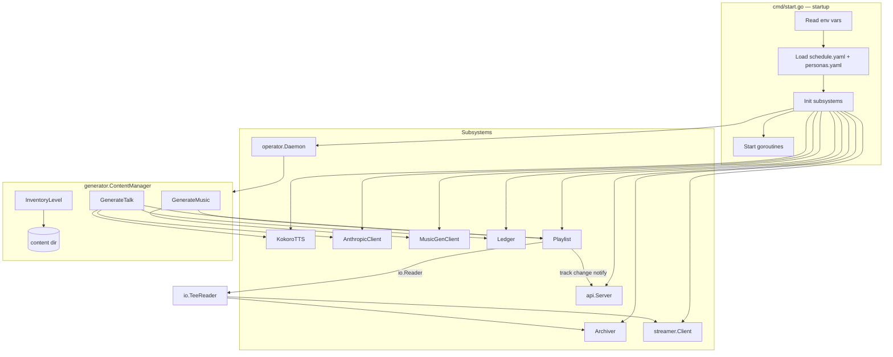

# Design Document

## Overview

This document describes the architecture for completing the AI Radio FM implementation. The goal is to wire together all existing, well-implemented subsystems — config loading, TTS, Anthropic script generation, MusicGen, the playlist, the archiver, the Icecast streamer, the ledger, and the API server — into a single coherent runtime. No new packages are introduced; the work is primarily in `cmd/app.go`, `cmd/start.go`, `cmd/generate.go`, and a new `generator/content_manager.go` that replaces the stub `AppContentManager`.

---

## Architecture



The key structural change is a `TeeReader` that wraps the `Playlist` so every byte sent to Icecast is simultaneously written to the `Archiver`. The `Playlist` gains a callback hook so callers are notified when the current track changes, enabling `now-playing` updates.

---

## Components and Interfaces

### 1. Environment Config — `config/env.go` (new)

A single `LoadEnv()` function reads all environment variables and returns a flat `RuntimeConfig` struct with typed fields and defaults. This keeps env-reading out of `cmd/start.go` and makes it testable.

```go
type RuntimeConfig struct {
    AnthropicAPIKey  string
    IcecastHost      string
    IcecastPort      int
    IcecastMount     string
    IcecastUser      string
    IcecastPassword  string
    ContentDir       string
    KokoroLibPath    string
    KokoroModelPath  string
    KokoroVoiceDir   string
    MusicGenURL      string
    ArchiveDir       string
    LedgerPath       string
    APIAddr          string
}
```

Defaults match the README values. `LoadEnv` does not validate file existence — that is deferred to the subsystem that uses each path.

---

### 2. Content Directory Helper — `generator/storage.go` (new)

Two pure functions used by `ContentManager` and `InventoryLevel`:

```go
// TalkDir returns the directory for a show's talk segments.
func TalkDir(contentDir, showID string) string

// MusicDir returns the directory for a show's music tracks.
func MusicDir(contentDir, showID string) string

// CountAudioFiles returns the number of .wav and .ogg files in dir.
func CountAudioFiles(dir string) (int, error)
```

These are extracted so they can be unit-tested without a running TTS engine.

---

### 3. ContentManager — `generator/content_manager.go` (new, replaces `cmd/app.go` stubs)

Implements `operator.ContentManager`. Holds references to all generator clients and the playlist.

```go
type ContentManager struct {
    anthropic  *AnthropicClient
    tts        *KokoroTTS          // may be nil if Kokoro paths are missing
    music      *MusicGenClient
    ledger     *ledger.Ledger
    playlist   *streamer.Playlist
    personas   *config.PersonasConfig
    contentDir string
    builder    *PromptBuilder
}
```

**`GenerateTalk(ctx, show)`**
1. Look up persona by `show.HostID` in `personas`. Return error if not found.
2. Read last 5 ledger entries for context via `ledger.ReadLast(5)`.
3. Build system + user prompts via `PromptBuilder`.
4. Call `anthropic.GenerateScript`. Return error on failure.
5. If `tts` is nil, log a warning and skip audio rendering; return nil (script-only mode).
6. Build output path: `{contentDir}/talk/{showID}/{timestamp}.wav`.
7. Call `tts.Render(ctx, script, persona.VoiceModel, outputPath)`.
8. Append ledger entry: action=`"talk_generated"`, summary=first 120 chars of script.
9. Enqueue `PlaylistItem{FilePath: outputPath, ShowID: show.ID}` onto playlist.

**`GenerateMusic(ctx, show)`**
1. Call `music.RequestGeneration` with a prompt derived from the show description.
2. Call `music.WaitForCompletion`.
3. Call `music.DownloadTrack` into `{contentDir}/music/{showID}/`.
4. Enqueue the downloaded file onto the playlist.

**`InventoryLevel(showID)`**
1. Sum `CountAudioFiles(TalkDir(...))` + `CountAudioFiles(MusicDir(...))`.
2. Return 0 on any error (triggers generation).

---

### 4. Playlist Track-Change Notification — `streamer/playlist.go` (modify)

Add an `OnTrackChange` callback field:

```go
type Playlist struct {
    // existing fields ...
    OnTrackChange func(item PlaylistItem)
}
```

When `Read` opens a new file (i.e., `p.currentFile` transitions from nil to a new file), call `OnTrackChange` if set. This is the only change to `playlist.go`.

---

### 5. Streaming TeeReader — `cmd/start.go` (modify)

Replace the direct `playlist` pass to `streamClient.Stream` with a `TeeReader`:

```go
tee := io.TeeReader(playlist, archiver)
go streamClient.Stream(ctx, tee)
```

The archiver's `Write` method already handles rollover logic, so no changes are needed there.

---

### 6. AppStreamMonitor — `cmd/app.go` (replace stubs)

`IsHealthy` performs an HTTP GET to `http://{icecastHost}:{icecastPort}/status-json.xsl`. It parses the minimal JSON response to check whether the configured mount point appears as an active source. Returns `false` on any network error or if the mount is absent.

`RestartStream` cancels the current stream context via a stored `context.CancelFunc` and starts a new goroutine calling `streamClient.Stream` with a fresh context. It calls `apiServer.UpdateHealth(false)` before restart and `UpdateHealth(true)` after the new stream goroutine successfully connects (detected by a brief ping or a channel signal from the stream goroutine).

The `AppStreamMonitor` struct gains fields:
```go
type AppStreamMonitor struct {
    client       *streamer.Client
    icecastCfg   streamer.IcecastConfig
    apiServer    *api.Server
    cancelStream context.CancelFunc
    playlist     *streamer.Playlist
    archiver     *streamer.Archiver
    streamCtx    context.Context
    mu           sync.Mutex
}
```

---

### 7. Startup Wiring — `cmd/start.go` (replace mock schedule)

Full startup sequence:

1. Call `config.LoadEnv()` → `RuntimeConfig`
2. Call `config.LoadSchedule("config/schedule.yaml")` and `config.LoadPersonas("config/personas.yaml")` — exit on error
3. Init `ledger.NewLedger(cfg.LedgerPath)`
4. Init `streamer.NewPlaylist()` with `OnTrackChange` wired to `apiServer.UpdateNowPlaying`
5. Init `streamer.NewArchiver(cfg.ArchiveDir, playlist)`
6. Init `streamer.NewClient(icecastCfg)`
7. Init `api.NewServer(cfg.APIAddr, schedule)`
8. Init `generator.NewKokoroTTS(...)` — if paths missing, `tts = nil`
9. Init `generator.NewContentManager(anthropic, tts, music, ledger, playlist, personas, cfg.ContentDir)`
10. Init `operator.NewDaemon(cm, sm, schedule)`
11. Wire `TeeReader`: `tee := io.TeeReader(playlist, archiver)`
12. Start goroutines: API server, stream (`tee`), daemon
13. Block on SIGINT/SIGTERM, then cancel context and call `archiver.Close()`

---

### 8. `cmd/generate.go` — load real config

Replace hardcoded persona/show/API key with:
1. Load `RuntimeConfig` from env
2. Load schedule and personas from config files
3. Use first show and its persona for the `generate talk` command
4. Pass real `ANTHROPIC_API_KEY` to `AnthropicClient`

---

## Data Models

No new persistent data models. The existing types cover all needs:

| Type | Package | Role |
|---|---|---|
| `RuntimeConfig` | `config` | Typed env var bag |
| `LedgerEntry` | `ledger` | Append-only audit log |
| `PlaylistItem` | `streamer` | File path + show ID |
| `NowPlayingInfo` | `api` | Live track metadata |
| `ScheduleConfig` / `PersonasConfig` | `config` | Station configuration |

Content files on disk follow this layout:
```
content/
  talk/
    {showID}/
      {RFC3339timestamp}.wav
  music/
    {showID}/
      {filename}.ogg
archive/
  archive_{timestamp}_{showID}.ogg
ledger.jsonl
```

---

## Error Handling

| Scenario | Behavior |
|---|---|
| Config file missing at startup | Log error, `os.Exit(1)` |
| `ANTHROPIC_API_KEY` not set | `GenerateTalk` returns error; daemon logs it and continues |
| Kokoro lib/model path missing | TTS init skipped; `tts = nil`; `GenerateTalk` skips audio step and logs warning |
| MusicGen server unreachable | `GenerateMusic` returns error; daemon logs it and continues |
| Icecast unreachable | `streamClient.Stream` retries with backoff (already implemented) |
| Playlist file missing on disk | `Playlist.Read` skips the file and dequeues the next item (already implemented) |
| Ledger write failure | Log error; do not fail the generation pipeline |
| `InventoryLevel` filesystem error | Return 0 (triggers generation, safe default) |

The daemon's `tick` loop already handles errors from `GenerateTalk` and `GenerateMusic` by logging and continuing, so individual generation failures do not crash the station.

---

## Testing Strategy

All new code is covered by unit tests. Integration tests that require live external services (Icecast, Anthropic, MusicGen, Kokoro) are gated by file/env checks and skip gracefully.

| Component | Test approach |
|---|---|
| `config.LoadEnv` | Table-driven tests with `t.Setenv` |
| `generator.CountAudioFiles` / `TalkDir` / `MusicDir` | `t.TempDir()` with fixture files |
| `generator.ContentManager.GenerateTalk` | Mock `AnthropicClient`, mock `KokoroTTS` interface, assert ledger entry and playlist enqueue |
| `generator.ContentManager.GenerateMusic` | Mock `MusicGenClient`, assert file downloaded and enqueued |
| `generator.ContentManager.InventoryLevel` | `t.TempDir()` with known file counts |
| `streamer.Playlist` OnTrackChange | Assert callback fires on file transition |
| `AppStreamMonitor.IsHealthy` | `httptest.NewServer` returning mock Icecast JSON |
| `cmd/start.go` wiring | Smoke test: start with temp config files, assert no panic, cancel immediately |
