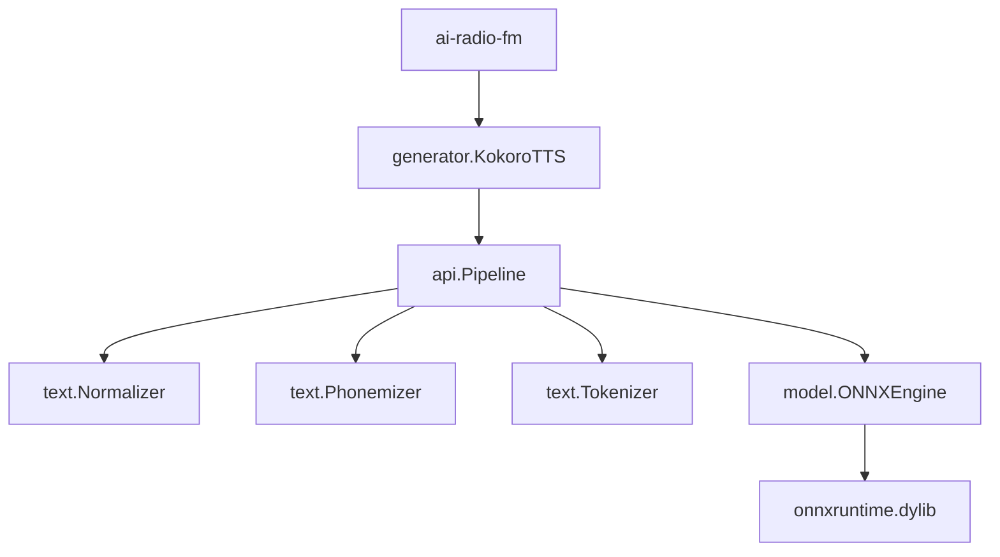

# Design Document: Kokoro Go Integration

## 1. Overview

This design outlines the refactoring of the `generator.KokoroTTS` component to replace its Python-based script execution with the native Go implementation provided by the `go-kokoro-tts` library. This change will improve performance by avoiding process forking and provide a more robust integration within the Go ecosystem.

## 2. Architecture

The `KokoroTTS` struct will act as a high-level wrapper around the `go-kokoro-tts/pkg/api.Pipeline`.

### Component Diagram



## 3. Components and Interfaces

### `generator.KokoroTTS`

The struct will be refactored to manage the lifecycle of the `api.Pipeline`.

```go
type KokoroTTS struct {
    pipeline *api.Pipeline
    engine   *model.ONNXEngine
    vLoader  *voice.VoiceLoader
    // paths for configuration
    modelPath string
    voiceDir  string
}
```

### Updated `NewKokoroTTS`

The constructor will handle the initialization of all pipeline components. It will require paths to the necessary model files and libraries.

**Signature:**
```go
func NewKokoroTTS(libPath, modelPath, vocabPath, voiceDir string) (*KokoroTTS, error)
```

### Updated `Render`

The `Render` method will continue to support the existing signature but will use the pipeline to synthesize audio. It will convert the resulting float array into a WAV file.

**Signature:**
```go
func (k *KokoroTTS) Render(ctx context.Context, text, voiceName, outputPath string) error
```

## 4. Data Models

We will use the existing configuration patterns in `ai-radio-fm` to pass paths to the `KokoroTTS` engine.

## 5. Error Handling

- **Initialization:** `NewKokoroTTS` will return explicit errors if the ONNX runtime library cannot be loaded, or if model/voice files are missing.
- **Synthesis:** `Render` will return errors if phonemization, tokenization, or inference fails.
- **Context:** All operations will respect the passed `context.Context` for cancellation.

## 6. Testing Strategy

- **Mocking:** Since `onnxruntime` is a CGO dependency, we will focus on ensuring the `KokoroTTS` wrapper correctly orchestrates the library calls.
- **Integration Tests:** A `generator/tts_test.go` will be added to verify that a short string can be rendered to a file (requires the environment to have `onnxruntime` and `espeak-ng`).
- **Validation:** Verify the output WAV file exists and has non-zero size.
