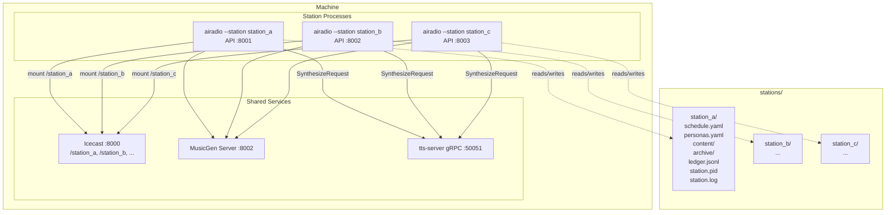

# Design Document

## Overview

This document describes the architecture for running up to five independent AI Radio FM stations on a single machine. The key changes are:

1. **Station directory layout** — `stations/<name>/` replaces the flat `config/` structure
2. **`--station` CLI flag** — drives path resolution and default mount point
3. **gRPC TTS sidecar** — a new `cmd/tts-server` binary in `go-kokoro-tts` replaces the in-process ONNX engine; all stations share it
4. **`GRPCTTSRenderer`** — a new `TTSRenderer` implementation in `ai-radio-fm` that calls the sidecar over gRPC instead of loading a local engine
5. **`stations.sh` orchestration script** — starts/stops/restarts all stations and the sidecar as separate OS processes

No changes are made to the streaming, playlist, archiver, API server, or operator daemon packages. The `TTSRenderer` interface already exists and absorbs the new gRPC client transparently.

---

## Architecture



### Process model

Each `airadio --station <name>` invocation is a fully independent OS process. The orchestration script (`stations.sh`) launches them as background jobs, captures their PIDs, and routes log output to per-station log files. There is no supervisor daemon — if a station crashes, the operator restarts it manually via `stations.sh restart <name>`.

---

## Components and Interfaces

### 1. Proto definition — `go-kokoro-tts/proto/tts.proto` (new)

```protobuf
syntax = "proto3";
package tts;
option go_package = "github.com/user/go-kokoro-tts/proto/tts";

service TTSService {
  rpc Synthesize (SynthesizeRequest) returns (SynthesizeResponse);
}

message SynthesizeRequest {
  string text       = 1;  // raw text to synthesize
  string voice_name = 2;  // voice profile name (e.g. "af_heart")
  string lang_code  = 3;  // espeak-ng language code (default "en-us")
  float  speed      = 4;  // speech speed multiplier (default 1.0)
}

message SynthesizeResponse {
  bytes  audio_pcm   = 1;  // raw float32 LE PCM samples, 24kHz mono
  int32  sample_rate = 2;  // always 24000
}
```

The response carries raw `float32` samples encoded as little-endian bytes. The client decodes them back to `[]float32` and writes a WAV file locally — keeping the sidecar stateless and the wire format simple.

---

### 2. TTS sidecar — `go-kokoro-tts/cmd/tts-server/main.go` (new)

A standalone gRPC server binary. Flags:

| Flag | Default | Description |
|---|---|---|
| `--addr` | `:50051` | gRPC listen address |
| `--lib` | `/usr/local/lib/libonnxruntime.so` | ONNX runtime shared library |
| `--model` | `kokoro-v0_19.onnx` | Kokoro ONNX model path |
| `--voice-dir` | `voices` | Voice profile directory |
| `--coreml` | `false` | Enable CoreML acceleration |
| `--cuda` | `false` | Enable CUDA acceleration |

Startup sequence:
1. Parse flags
2. Init `model.ONNXEngine` (fatal on error)
3. Init `api.Pipeline` with normalizer, phonemizer, tokenizer
4. Init `voice.BinaryVoiceLoader`
5. Init `text.Chunker(500)`
6. Register `TTSServiceServer` and start gRPC listener
7. Block on SIGINT/SIGTERM, then call `engine.Close()`

The `Synthesize` RPC handler:
1. Chunks the input text via `Chunker`
2. For each chunk: loads voice profile, calls `pipeline.Synthesize`
3. Concatenates all `[]float32` samples
4. Encodes as little-endian bytes and returns in `SynthesizeResponse`

Concurrency: the existing `ONNXEngine.mu` mutex serializes inference. gRPC handles concurrent incoming requests — they queue on the mutex. This is correct and safe; synthesis is CPU-bound so parallelism would not help anyway.

---

### 3. gRPC TTS client — `ai-radio-fm/generator/grpc_tts.go` (new)

Implements the existing `TTSRenderer` interface. The `ContentManager` receives it as a `TTSRenderer` — no changes needed to `ContentManager`, `NewContentManager`, or `cmd/start.go`'s TTS init logic beyond swapping which concrete type is constructed.

```go
type GRPCTTSRenderer struct {
    client  ttspb.TTSServiceClient
    conn    *grpc.ClientConn
    voiceDir string // local path for WAV writing (audio comes back as bytes)
}

func NewGRPCTTSRenderer(addr string) (*GRPCTTSRenderer, error)
func (g *GRPCTTSRenderer) Render(ctx context.Context, text, voiceName, outputPath string) error
func (g *GRPCTTSRenderer) Close() error
```

`Render` sends a `SynthesizeRequest`, receives `[]byte` PCM, decodes to `[]float32`, and calls `audio.WriteWAV(outputPath, samples, 24000)` locally. The `audio` package is already a dependency of `ai-radio-fm` via `go-kokoro-tts`.

Fallback: if `NewGRPCTTSRenderer` fails to connect, `cmd/start.go` logs a warning and passes `nil` as the `TTSRenderer` — identical to the existing Kokoro path-missing behaviour.

---

### 4. Station path resolution — `config/station.go` (new)

A small helper that centralises all path derivation for a named station:

```go
type StationPaths struct {
    Name        string
    Dir         string // stations/<name>/
    ScheduleFile string // stations/<name>/schedule.yaml
    PersonasFile string // stations/<name>/personas.yaml
    ContentDir  string // stations/<name>/content/
    ArchiveDir  string // stations/<name>/archive/
    LedgerPath  string // stations/<name>/ledger.jsonl
}

func StationPathsFor(name string) StationPaths
```

`cmd/start.go` calls `StationPathsFor(stationName)` when `--station` is set and uses the returned paths instead of the env-var defaults. Env vars still override individual paths when set explicitly.

---

### 5. `--station` flag — `cmd/start.go` (modify)

Add a `--station` persistent flag to the `start` command:

```go
var stationName string
startCmd.Flags().StringVar(&stationName, "station", "", "Station name (loads from stations/<name>/)")
```

When `stationName != ""`:
- Validate `stations/<name>/` exists; fatal if not
- Call `StationPathsFor(name)` to get all paths
- Override `cfg.ContentDir`, `cfg.ArchiveDir`, `cfg.LedgerPath` with station paths (unless those env vars are explicitly set)
- Default `cfg.IcecastMount` to `name` (unless `ICECAST_MOUNT` is set)
- Load schedule from `paths.ScheduleFile`, personas from `paths.PersonasFile`

When `stationName == ""`:
- Existing behaviour unchanged (loads from `config/`, uses env vars as-is)

---

### 6. TTS init in `cmd/start.go` (modify)

Replace the current in-process Kokoro init block with a two-path decision:

```
if TTS_GRPC_ADDR is set or --station is set:
    try NewGRPCTTSRenderer(cfg.TTSGRPCAddr)
    on failure: log warning, tts = nil
else:
    existing local Kokoro init (lib/model path check)
```

Add `TTSGRPCAddr string` to `RuntimeConfig`, read from `TTS_GRPC_ADDR` env var (default `""`). When empty and `--station` is not set, the existing local engine path is used — full backwards compatibility.

---

### 7. `RuntimeConfig` additions — `config/env.go` (modify)

Add one field:

```go
TTSGRPCAddr string  // TTS_GRPC_ADDR, default ""
```

When `TTSGRPCAddr` is non-empty, `cmd/start.go` uses the gRPC renderer. When empty and no `--station` flag, it falls back to the local ONNX path.

---

### 8. Orchestration script — `stations.sh` (new, repo root)

A bash script. Station definitions are discovered by scanning `stations/*/schedule.yaml`. Each station's environment is sourced from `stations/<name>/.env` if present, with fallback to a shared `stations/.env.shared` for common values (Icecast host/port/password, MusicGen URL, Anthropic key, TTS gRPC addr).

Port assignment strategy: the script reads `API_ADDR` from each station's `.env` file. If not set, it assigns ports sequentially starting from `:8001`. Mount point defaults to `/<name>` unless `ICECAST_MOUNT` is set in the station's `.env`.

Conflict detection: before starting, the script collects all mount points and API ports across all stations and checks for duplicates. If any are found, it prints the conflicting station names and exits 1.

Commands:
- `start` — start TTS sidecar + all stations
- `stop` — SIGTERM all station PIDs + TTS sidecar PID
- `status` — check each PID file, print running/stopped
- `restart <name>` — stop + start one station
- `logs <name>` — `tail -f stations/<name>/station.log`

PID files: `stations/<name>/station.pid`, `stations/tts-server.pid`
Log files: `stations/<name>/station.log`

---

### 9. Example station — `stations/example_station/` (new)

Copy of `config/schedule.yaml.example` and `config/personas.yaml.example` placed at:
- `stations/example_station/schedule.yaml`
- `stations/example_station/personas.yaml`
- `stations/example_station/.env.example` — documents all per-station env vars with comments

---

## Data Models

No new persistent data models. The `StationPaths` struct is a pure value type used only at startup. The on-disk layout per station:

```
stations/
  .env.shared              # shared env vars (Icecast, MusicGen, Anthropic, TTS addr)
  tts-server.pid           # PID of the running tts-server process
  <name>/
    schedule.yaml          # show definitions
    personas.yaml          # host persona definitions
    .env                   # per-station overrides (API_ADDR, ICECAST_MOUNT, etc.)
    .env.example           # documented template
    content/
      talk/<show_id>/      # generated WAV files
      music/<show_id>/     # downloaded music tracks
    archive/               # rolling Ogg Vorbis archive files
    ledger.jsonl           # append-only generation log
    station.pid            # PID of the running airadio process
    station.log            # stdout+stderr of the airadio process
```

### Proto wire format

`SynthesizeResponse.audio_pcm` is raw littn `float32` samples at 24kHz mono. The client decodes with `encoding/binary` into `[]float32` and passes directly to `audio.WriteWAV`. No intermediate encoding.

---

## Error Handling

| Scenario | Behavior |
|---|---|
| `--station <name>` dir missing | Fatal at startup with path printed |
| `stations/<name>/schedule.yaml` missing | Fatal at startup (existing behaviour) |
| TTS sidecar unreachable at station startup | Log warning, `tts = nil`, script-only mode |
| TTS sidecar crashes while station is running | Next `Render` call returns gRPC error → `GenerateTalk` returns error → daemon logs and continues |
| TTS sidecar timeout (>60s) | gRPC deadline exceeded error propagates to `GenerateTalk` → daemon logs and continues |
| Two stations with same mount point | `stations.sh` detects before starting, exits 1 with conflict message |
| Two stations with same API port | `stations.sh` detects before starting, exits 1 with conflict message |
| Station process crashes | PID file remains stale; `status` command detects dead PID and reports stopped |
| `stations.sh stop` with missing PID file | Logs "not running" for that station, continues stopping others |

---

## Testing Strategy

| Component | Approach |
|---|---|
| `config.StationPathsFor` | Unit tests: verify all paths for a given name, including edge cases (name with hyphens, underscores) |
| `GRPCTTSRenderer.Render` | Unit test with an in-process gRPC test server (`bufconn`) returning known PCM bytes; assert WAV file written correctly |
| TTS sidecar `Synthesize` RPC | Integration test gated on ONNX lib presence; uses `bufconn` to avoid real network |
| `cmd/start.go` `--station` flag | Test that `StationPathsFor` is called and paths are set correctly; use `t.TempDir()` with fixture YAML files |
| `stations.sh` conflict detection | Tested by creating fixture `.env` files with duplicate ports/mounts and asserting exit code 1 |
| Backwards compatibility | Existing `go test ./...` must pass unchanged — no `--station` flag means old behaviour |

> **Risk flag**: The gRPC sidecar adds a network hop (loopback) to every TTS render. On a loaded machine with 5 stations generating concurrently, all requests will queue on the `ONNXEngine` mutex. Synthesis of a typical 600-word script takes ~10–30 seconds on CPU. With 5 stations, worst-case queue depth is 5 × 30s = 150s. This is acceptable for a background content generation daemon (not real-time), but operators should be aware that content generation will be slower under load than with dedicated per-station engines. The 60-second gRPC deadline in `Render` should be raised to 120 seconds to accommodate this.
